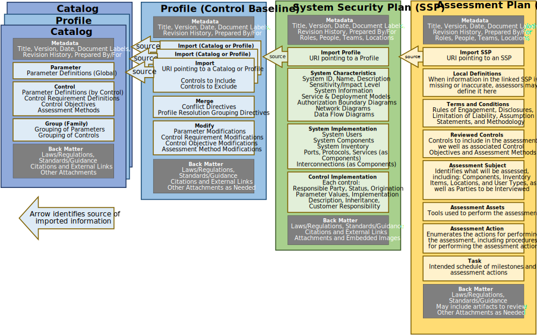

| Assessment Plan Schema | Assessment Plan Converters | Reference
|:--- |:--- |:--- |
| [JSON Schema](https://raw.githubusercontent.com/usnistgov/OSCAL/main/json/schema/oscal_assessment-plan_schema.json) | [XML to JSON Converter](https://raw.githubusercontent.com/usnistgov/OSCAL/main/json/convert/oscal_assessment-plan_xml-to-json-converter.xsl) ([How do I use this?](https://github.com/usnistgov/OSCAL/tree/main/json#converting-oscal-xml-content-to-json)) | [Outline](/reference/latest/assessment-plan/json-outline/) [Reference](/reference/latest/assessment-plan/json-reference/) [Index](/reference/latest/assessment-plan/json-index/) |
| [XML Schema](https://raw.githubusercontent.com/usnistgov/OSCAL/main/xml/schema/oscal_assessment-plan_schema.xsd) | [JSON to XML Converter](https://raw.githubusercontent.com/usnistgov/OSCAL/main/xml/convert/oscal_assessment-plan_json-to-xml-converter.xsl) ([How do I use this?](https://github.com/usnistgov/OSCAL/tree/main/xml#converting-oscal-json-content-to-xml)) | [Outline](/reference/latest/assessment-plan/xml-outline/) [Reference](/reference/latest/assessment-plan/xml-reference/) [Index](/reference/latest/assessment-plan/xml-index/) |

## Purpose

The OSCAL assessment plan model represents the information contained within an assessment plan, and is typically used by anyone planning to perform an assessment or continuous monitoring activities on an information system to determine the degree to which that system complies with a given control [baseline](/concepts/terminology/#baseline) used by the system.

It was designed to use identical syntax to the [assessment results model](../assessment-results/), for overlapping assemblies (Objectives, Assessment Subject, Assets, and Assessment Activities).

## Authors and Consumers

The OSCAL assessment plan model is useful to the following authors and consumers.

### Assessment Plan Authors

Assessors, Continuous Assessment Planners

Assessors develop the assessment plan to clearly identify the intended scope, target, and activities for an assessment.

### Assessment Plan Consumers

Assessment Practitioners, Authorizing Officials, Continuous Assessment Implementers

Assessment practitioners consume an assessment plan as they execute the assessment to ensure the intended scope, target, and activities are being honored.

Authorizing Officials consume an assessment plan in the adjudication of a system as part of approving an authorization to operate.

Continuous assessment implementers consume an assessment plan when establishing automated continuous assessment mechanisms.

## Model Overview

{}
{}
{}
An OSCAL profile is organized as follows:
- **Metadata**: Metadata syntax is identical and required in all OSCAL models. It includes information such as the document's title, publication version, publication date, and OSCAL version. Metadata is also used to define roles, parties (people, teams and organizations), and locations.
- **Import SSP**: Identifies the OSCAL-based SSP of the system being assessed. Several pieces of information about a system that normally appear in an assessment plan are now referenced via this import statement, eliminating the need to duplicate and maintain the same information in multiple places.
- **Local Definitions**: Normally other aspects of the assessment plan point to content in the linked SSP. When the AP must reference information that is missing from linked SSP, assessors define it here instead.
- **Terms and Conditions**: Identifies the rules of engagement, disclosures, limitation of liability statements, assumption statements, methodology, and other explanatory content as needed.
- **Reviewed Controls**: Identifies the controls to be included within the scope of the assessment, as well as the control objectives and assessment methods.
- **Assessment Subject**: Identifies the elements of the system that are in scope for the assessment, including locations, components, inventory items, and users.
- **Assessment Assets**: Identifies the assessor's assets used to perform the assessment, including the teams, tools, and rules of engagement.
- **Assessment Action**: Describes the manual and automated activities that are intended to be as part of the assessment. This includes the steps required to perform the action.
- **Task**: Identifies the intended schedule of milestones and assessment actions.
- **Back Matter**: Back matter syntax is identical in all OSCAL models. It is used for attachments, citations, and embedded content such as graphics.
{}
{}

{}
{}
{}

## Key Concepts

The OSCAL assessment plan model defines the information contained within an assessment plan.

This model is typically used by anyone planning to perform an assessment or continuous monitoring activities on a system to determine the degree to which that system complies with one or more frameworks.

This model allows an assessor to express all details associated with a classic "snapshot in time" assessment, including the scope of the assessment, schedule, intended activities, and the rules of engagement. It also allows organizations to specify clear continuous monitoring parameters, such as frequency and method of monitoring, as well as the roles responsible monitoring various aspects of the system.

An OSCAL assessment plan is always defined in the context of a specific system, and must always be associated with an OSCAL [System Security Plan (SSP)](../../implementation/ssp/).

The current version of this model was created based on the information requirements of a [FedRAMP Security Assessment Plan](https://www.fedramp.gov/assets/resources/templates/FedRAMP-Annual-SAP-Template.docx), and was expanded to include continuous monitoring capabilities.
It was designed to use syntax identical to the [assessment results model](../assessment-results/), for overlapping assemblies (Objectives, Assessment Subject, Assets, and Assessment Activities).

The figure below expresses represents the portion of the OSCAL stack as it relates to an OSCAL Assessment Plan.


